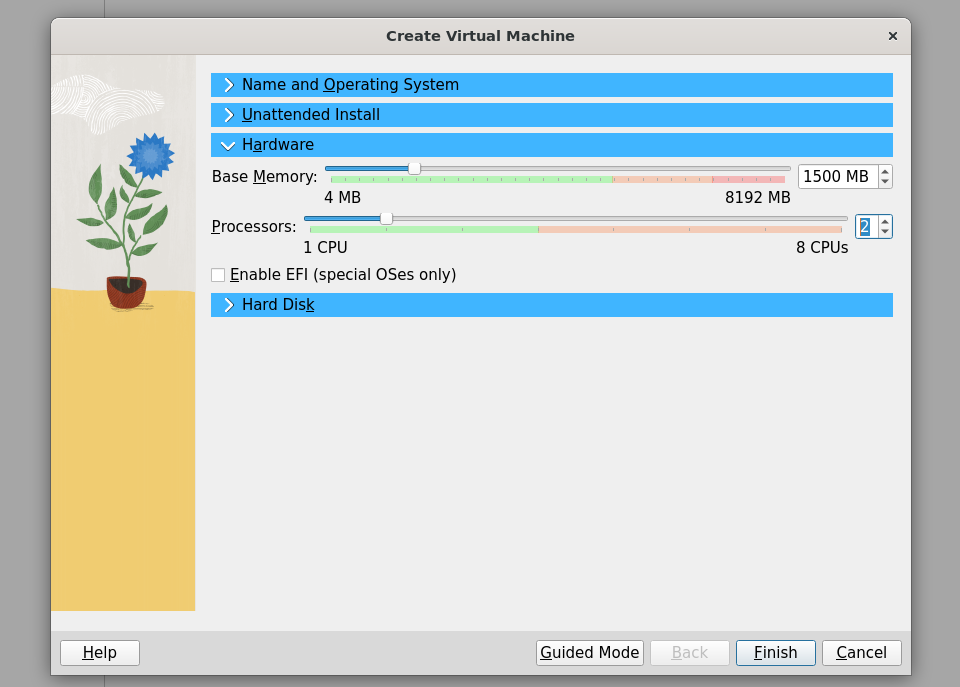
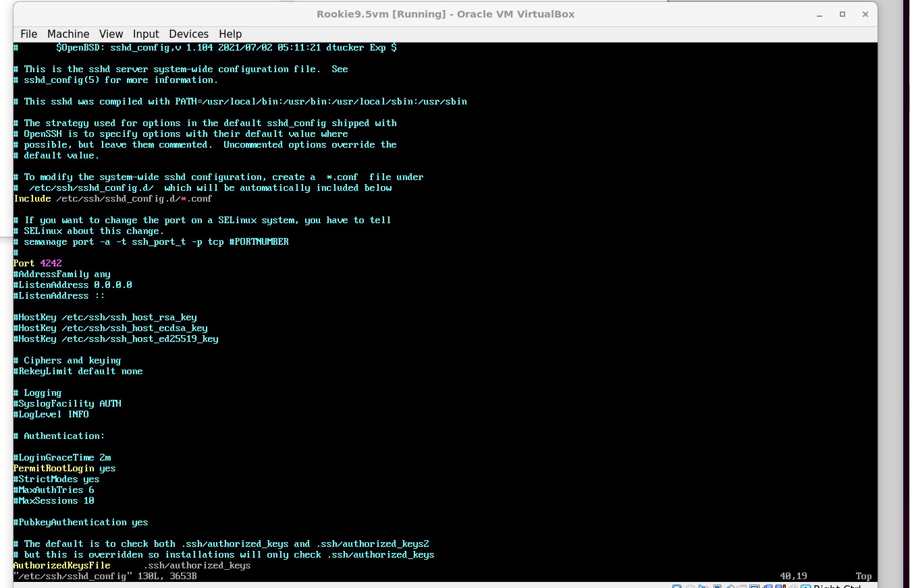
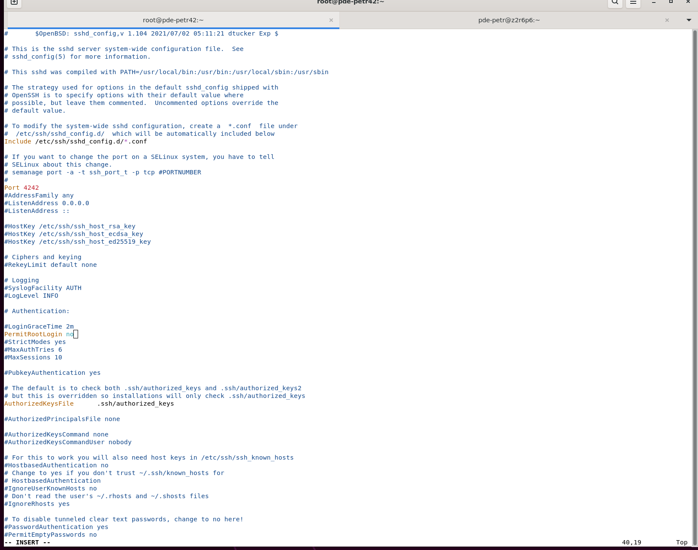

# Born to Be Root Rookie 42 <a href="https://github.com/polodu13160">
  
</a>

### DEFINITIONS 
### SELinux

SELinux (Security-Enhanced Linux) est un module de sécurité pour le noyau Linux qui fournit un mécanisme de contrôle d'accès obligatoire. Il permet de définir des politiques de sécurité qui restreignent les actions que les utilisateurs et les processus peuvent effectuer, améliorant ainsi la sécurité du système.

### firewalld

firewalld est un outil de gestion de pare-feu dynamique pour Linux. Il fournit une interface pour configurer et gérer les règles de pare-feu, permettant de contrôler le trafic réseau entrant et sortant. firewalld utilise des zones pour définir différents niveaux de confiance pour les connexions réseau.

### SSH

SSH (Secure Shell) est un protocole réseau cryptographique utilisé pour sécuriser les connexions réseau. Il permet aux utilisateurs de se connecter à des machines distantes de manière sécurisée, d'exécuter des commandes et de transférer des fichiers. SSH utilise le chiffrement pour protéger les données transmises sur le réseau.

### DNF

DNF (Dandified YUM) est le gestionnaire de paquets de la distribution Linux Fedora et de ses dérivés, comme Rocky Linux. Il permet d'installer, mettre à jour et supprimer des paquets logiciels. DNF résout automatiquement les dépendances des paquets et gère les dépôts de logiciels.

### SEMANAGE

Semanage est une commande utilisée pour gérer les politiques de sécurité SELinux. Elle permet de modifier les contextes de sécurité, les ports, les interfaces et les utilisateurs définis par SELinux.
 

## I - Installation

Vous pouvez suivre l'installation via la documentation officielle : [Rocky Linux Installation Guide](https://docs.rockylinux.org/guides/installation/). Cependant, elle n'est pas à jour actuellement.

Téléchargez la dernière version de Rocky Minimalist depuis : [Rocky Linux Downloads](https://download.rockylinux.org/pub/rocky/9/isos/x86_64/).

Pourquoi choisir Rocky Minimalist ? Cela permet d'avoir une ISO avec une interface non graphique.

Vérifiez que votre ISO n'est pas corrompue à cause d'une erreur de téléchargement en utilisant le Checksum : [Checksum](https://download.rockylinux.org/pub/rocky/9.5/isos/x86_64/).

Pour vérifier, lancez la commande suivante dans le même dossier où se trouvent l'ISO et le Checksum :

```sh
sha256sum -c CHECKSUM --ignore-missing
```

Si dans le résultat vous voyez :

```
Rocky-9.3-x86_64-minimal.iso: OK
```

c'est bon, vous pouvez passer à l'étape suivante.

### Lancer Oracle VM

1. Cliquez sur l'onglet "Machine".
2. Cliquez sur "Créer".
3. Dans la partie "Name and Operating System", choisissez un nom pour la VM (par exemple : Rookie9.5).
4. Sélectionnez l'ISO que vous avez téléchargée.
5. Cliquez sur "Skip Unattended Installation" (pas utile).


### Configuration de la VM

1. Dans "Hardware", mettez un processeur à 2 CPU et une mémoire de base à plus de 1500 MB.



2. Dans "Harddisk", essayez de respecter la consigne des 40 GB et cliquez sur "Finish".

3. Allez dans les paramètres de votre VM :


4. Dans "Network", cliquez sur "Port Forwarding" dans "Advanced" et créez une règle avec le port 4242 dans "Host Port" et "Guest Port".


Validez, puis vous pouvez maintenant lancer la VM.


### Installation de Rocky Linux

1. Allez directement sur Rocky Linux 9.5, cela va lancer une interface graphique.
2. Si cela plante, fermez et relancez la VM.
3. Pour retrouver votre souris sur votre machine hôte, utilisez "Ctrl" de droite.


4. Pensez à changer le clavier pour le mettre en anglais (US, Euro sur le SI).


5. Dans "Destination de l'installation", choisissez "Personnalisé" afin de pouvoir faire un bon partitionnement comme demandé dans l'énoncé.


6. Dans "Configuration", mettez "Personnalisé" et cliquez sur "Terminé".


7. Cliquez sur "Créer automatiquement" pour aller plus vite.


8. Créez un groupe de volumes :


Pensez à le chiffrer et à mettre LUKS 1, qui est plus fiable que LUKS 2. Cliquez sur "Enregistrer".

9. Pour "boot", modifiez le système de fichiers en ext4.


10. Pour "swap", mettez le groupe de volumes mais laissez le système de fichiers en swap.

11. Créez les autres partitions de cette façon :


Pour obtenir ce rendu final :


12. sda2 ne sert à rien donc pas besoin de le créer. Cliquez sur "Terminé".


### Create Root User

13. Create a root user and set a password.


14. Begin the installation process. The VM will restart and prompt for the encryption password.


### Configuration SSH

1. Installez vim :

```sh
dnf install vim
```

Cette commande utilise DNF pour installer l'éditeur de texte Vim.

2. Modifiez le fichier de configuration SSH :

```sh
vim /etc/ssh/sshd_config
```

Cette commande ouvre le fichier de configuration SSH avec Vim.



Décommentez "Port" et modifiez-le en port 4242. Décommentez "PermitRootLogin" et mettez à "yes" pour permettre de se connecter en root via SSH pour l'instant (nous le passerons à "no" plus tard). Enregistrez.

3. Installez les utilitaires de policycoreutils :

```sh
sudo dnf install policycoreutils-python-utils
```

Cette commande installe les utilitaires nécessaires pour gérer les politiques SELinux.

4. Ajoutez une nouvelle règle sur le port 4242 :

```sh
semanage port -a -t ssh_port_t -p tcp 4242
```

Cette commande ajoute une règle SELinux pour permettre l'utilisation du port 4242 pour SSH.

5. Acceptez le port sur le firewall :

```sh
firewall-cmd --zone=public --add-port=4242/tcp --permanent
firewall-cmd --reload
```

Ces commandes ajoutent une règle de pare-feu pour accepter les connexions sur le port 4242 et rechargent la configuration du pare-feu.

6. Redémarrez le service SSH :

```sh
systemctl restart sshd
```

Cette commande redémarre le service SSH pour appliquer les modifications.

### Configuration initiale (Primary setup)

1. Gestion de la politique des mots de passe :

```sh
vim /etc/security/pwquality.conf
```

Cette commande ouvre le fichier de configuration de l'authentification des mots de passe avec Vim, et modifier comme dans la photo ci dessous (juste décommenter et modifier) : 


Voici une explication plus propre des paramètres de configuration des mots de passe :

- `minlen` : Définit la longueur minimale du mot de passe.
- `retry` : Nombre maximal de tentatives autorisées pour entrer un mot de passe.
- `difok` : Nombre minimal de caractères différents par rapport à l'ancien mot de passe.
- `dcredit`, `lcredit`, `ucredit` : Exigent que le mot de passe contienne au moins un chiffre, une lettre minuscule et une lettre majuscule.
- `maxrepeat` : Nombre maximal de répétitions consécutives d'un même caractère.
- `enforce_for-root` : force la politique de mot de passe en root et en sudo .

En configurant ces paramètres, vous pouvez définir des règles de mot de passe strictes pour les utilisateurs. Par exemple, les utilisateurs non-root devront changer leur mot de passe pour qu'il soit différent de l'ancien d'au moins 7 caractères, tandis que l'utilisateur root pourra réutiliser le même mot de passe.

2. Modifiez les paramètres dans `/etc/login.defs` :


Recherchez et modifiez les lignes suivantes pour qu'elles correspondent aux valeurs requises :

```sh
PASS_MAX_DAYS   30
PASS_MIN_DAYS   2
PASS_WARN_AGE   7
```

Ces paramètres définissent la durée maximale de validité d'un mot de passe (30 jours), le nombre minimal de jours entre les changements de mot de passe (2 jours) et le nombre de jours avant l'expiration du mot de passe où l'utilisateur sera averti (7 jours).


3. Appliquez les modifications pour l'utilisateur root :

```sh
chage -m 2 -M 30 -W 7 root
passwd root
chage -l root
```

Ces commandes modifient les paramètres de gestion des mots de passe pour l'utilisateur root, définissent un nouveau mot de passe et affichent les informations de changement de mot de passe.


4. Changer le hostname :

```sh
hostname 'lenomquetuveux'
vim /etc/hostname
```

Ces commandes changent le nom d'hôte de la machine.


5. Créer un utilisateur :

```sh
adduser pde-petr
passwd pde-petr
groupadd user42
usermod -a -G user42 pde-petr
```

Ces commandes créent un nouvel utilisateur, définissent son mot de passe, créent un nouveau groupe et ajoutent l'utilisateur au groupe.

6. Renommer le groupe sudo :

```sh
groupmod -n sudo wheel
```

Cette commande renomme le groupe `wheel` en `sudo`.

7. Afficher les utilisateurs et groupes
```sh
getent passwd
getent group
getent group user42
```

Ces commandes affichent les informations sur les utilisateurs et les groupes du système.

### Explications des commandes

1. `getent passwd` : Affiche la liste de tous les utilisateurs du système.
2. `getent group` : Affiche la liste de tous les groupes du système.
3. `getent group user42` : Affiche les informations sur le groupe nommé `user42`, y compris les utilisateurs qui appartiennent à ce groupe.

### Configuration de sudo

1. Ouvrez le fichier sudoers :

```sh
visudo
```

Cette commande ouvre le fichier de configuration sudoers avec l'éditeur visudo. et rajouter :

```sh
Defaults secure_path = /usr/local/sbin:/usr/local/bin:/usr/sbin:/usr/bin:/sbin:/bin:/snap/bin
%sudo ALL=!/bin/su, !/bin/bash, !/bin/sh , !/bin/passwd
Defaults requiretty
Defaults passwd_tries=3
Defaults log_input, log_output
Defaults iolog_dir = /var/log/sudo/
Defaults badpass_message="Mot de passe incorrect, merci de réessayer. Si vous avez oublié le mot de passe, contactez votre administrateur."
```

### Explication des paramètres

- `secure_path` : Définit les chemins sécurisés pour les commandes sudo.
- `%sudo ALL=!/bin/su, !/bin/bash, !/bin/sh, !/bin/passwd` : Interdit aux utilisateurs du groupe sudo d'utiliser les commandes su, bash et sh et passwd avec la commande sudo.
- `requiretty` : Nécessite une session TTY pour exécuter sudo.
- `passwd_tries` : Limite le nombre de tentatives de mot de passe à 3.
- `log_input, log_output` : Active la journalisation des entrées et sorties des commandes sudo.
- `iolog_dir` : Spécifie le répertoire de journalisation des entrées/sorties.
- `badpass_message` : Message affiché en cas de mot de passe incorrect.

### Monitoring

1. Mettez à jour les dépendances de package :

```sh
dnf update
systemctl enable crond
```

Ces commandes mettent à jour les paquets du système et activent le service cron pour planifier des tâches.

2. Configurez crontab pour exécuter le script de monitoring :

```sh
crontab -e
```

Cette commande ouvre l'éditeur de crontab pour l'utilisateur actuel.

Ajoutez :

```sh
*/10 * * * * /root/monitoring.sh
```

Ces lignes ajoutent des tâches planifiées pour exécuter le script de monitoring toutes les 10 minutes et au démarrage du système.

Assurez-vous que le script est exécutable :

```sh
chmod +x /path/to/monitoring.sh
```

Cette commande rend le script exécutable.

### Interdire la connexion SSH en root

1. Modifiez le fichier de configuration SSH :

```sh
vim /etc/ssh/sshd_config
```

Cette commande ouvre le fichier de configuration SSH avec Vim.



Mettez "no" sur "PermitRootLogin". Enregistrez et redémarrez le service SSH :

```sh
systemctl restart sshd
```

Cette commande redémarre le service SSH pour appliquer les modifications.

### Tester les commandes et régler les problèmes

1. Vérifiez les ports ouverts :

```sh
ss -tunlp
```

Cette commande affiche les ports ouverts et les services associés.

2. Fermez le port 323 si ouvert :

```sh
sudo dnf install lsof
sudo lsof -i :323
sudo dnf remove chrony
```

Ces commandes installent lsof, vérifient les services utilisant le port 323 et suppriment le service chrony si nécessaire.

3. Fermez les services inutiles sur le firewall :

```sh
sudo firewall-cmd --permanent --remove-service=cockpit
sudo firewall-cmd --permanent --remove-service=dhcpv6-client
sudo firewall-cmd --reload
```

Ces commandes suppriment les services inutiles du pare-feu et rechargent la configuration du pare-feu.

Pour plus de détails pour les bonus, consultez ce [GitHub](https://github.com/AGolz/Born2beRoot?tab=readme-ov-file).
### DEFINITIONS 
### SELinux

SELinux (Security-Enhanced Linux) est un module de sécurité pour le noyau Linux qui fournit un mécanisme de contrôle d'accès obligatoire. Il permet de définir des politiques de sécurité qui restreignent les actions que les utilisateurs et les processus peuvent effectuer, améliorant ainsi la sécurité du système.

### firewalld

firewalld est un outil de gestion de pare-feu dynamique pour Linux. Il fournit une interface pour configurer et gérer les règles de pare-feu, permettant de contrôler le trafic réseau entrant et sortant. firewalld utilise des zones pour définir différents niveaux de confiance pour les connexions réseau.

### SSH

SSH (Secure Shell) est un protocole réseau cryptographique utilisé pour sécuriser les connexions réseau. Il permet aux utilisateurs de se connecter à des machines distantes de manière sécurisée, d'exécuter des commandes et de transférer des fichiers. SSH utilise le chiffrement pour protéger les données transmises sur le réseau.

### DNF

DNF (Dandified YUM) est le gestionnaire de paquets de la distribution Linux Fedora et de ses dérivés, comme Rocky Linux. Il permet d'installer, mettre à jour et supprimer des paquets logiciels. DNF résout automatiquement les dépendances des paquets et gère les dépôts de logiciels.

### SEMANAGE

Semanage est une commande utilisée pour gérer les politiques de sécurité SELinux. Elle permet de modifier les contextes de sécurité, les ports, les interfaces et les utilisateurs définis par SELinux.
 

## I - Installation

Vous pouvez suivre l'installation via la documentation officielle : [Rocky Linux Installation Guide](https://docs.rockylinux.org/guides/installation/). Cependant, elle n'est pas à jour actuellement.

Téléchargez la dernière version de Rocky Minimalist depuis : [Rocky Linux Downloads](https://download.rockylinux.org/pub/rocky/9/isos/x86_64/).

Pourquoi choisir Rocky Minimalist ? Cela permet d'avoir une ISO avec une interface non graphique.

Vérifiez que votre ISO n'est pas corrompue à cause d'une erreur de téléchargement en utilisant le Checksum : [Checksum](https://download.rockylinux.org/pub/rocky/9.5/isos/x86_64/).

Pour vérifier, lancez la commande suivante dans le même dossier où se trouvent l'ISO et le Checksum :

```sh
sha256sum -c CHECKSUM --ignore-missing
```

Si dans le résultat vous voyez :

```
Rocky-9.3-x86_64-minimal.iso: OK
```

c'est bon, vous pouvez passer à l'étape suivante.

### Lancer Oracle VM

1. Cliquez sur l'onglet "Machine".
2. Cliquez sur "Créer".
3. Dans la partie "Name and Operating System", choisissez un nom pour la VM (par exemple : Rookie9.5).
4. Sélectionnez l'ISO que vous avez téléchargée.
5. Cliquez sur "Skip Unattended Installation" (pas utile).


### Configuration de la VM

1. Dans "Hardware", mettez un processeur à 2 CPU et une mémoire de base à plus de 1500 MB.


2. Dans "Harddisk", essayez de respecter la consigne des 40 GB et cliquez sur "Finish".

3. Allez dans les paramètres de votre VM :


4. Dans "Network", cliquez sur "Port Forwarding" dans "Advanced" et créez une règle avec le port 4242 dans "Host Port" et "Guest Port".


Validez, puis vous pouvez maintenant lancer la VM.


### Installation de Rocky Linux

1. Allez directement sur Rocky Linux 9.5, cela va lancer une interface graphique.
2. Si cela plante, fermez et relancez la VM.
3. Pour retrouver votre souris sur votre machine hôte, utilisez "Ctrl" de droite.


4. Pensez à changer le clavier pour le mettre en anglais (US, Euro sur le SI).


5. Dans "Destination de l'installation", choisissez "Personnalisé" afin de pouvoir faire un bon partitionnement comme demandé dans l'énoncé.


6. Dans "Configuration", mettez "Personnalisé" et cliquez sur "Terminé".


7. Cliquez sur "Créer automatiquement" pour aller plus vite.


8. Créez un groupe de volumes :


Pensez à le chiffrer et à mettre LUKS 1, qui est plus fiable que LUKS 2. Cliquez sur "Enregistrer".

9. Pour "boot", modifiez le système de fichiers en ext4.


10. Pour "swap", mettez le groupe de volumes mais laissez le système de fichiers en swap.

11. Créez les autres partitions de cette façon :


Pour obtenir ce rendu final :


12. sda2 ne sert à rien donc pas besoin de le créer. Cliquez sur "Terminé".


### Create Root User

13. Create a root user and set a password.


14. Begin the installation process. The VM will restart and prompt for the encryption password.


### Configuration SSH

1. Installez vim :

```sh
dnf install vim
```

Cette commande utilise DNF pour installer l'éditeur de texte Vim.

2. Modifiez le fichier de configuration SSH :

```sh
vim /etc/ssh/sshd_config
```

Cette commande ouvre le fichier de configuration SSH avec Vim.


Décommentez "Port" et modifiez-le en port 4242. Décommentez "PermitRootLogin" et mettez à "yes" pour permettre de se connecter en root via SSH pour l'instant (nous le passerons à "no" plus tard). Enregistrez.

3. Installez les utilitaires de policycoreutils :

```sh
sudo dnf install policycoreutils-python-utils
```

Cette commande installe les utilitaires nécessaires pour gérer les politiques SELinux.

4. Ajoutez une nouvelle règle sur le port 4242 :

```sh
semanage port -a -t ssh_port_t -p tcp 4242
```

Cette commande ajoute une règle SELinux pour permettre l'utilisation du port 4242 pour SSH.

5. Acceptez le port sur le firewall :

```sh
firewall-cmd --zone=public --add-port=4242/tcp --permanent
firewall-cmd --reload
```

Ces commandes ajoutent une règle de pare-feu pour accepter les connexions sur le port 4242 et rechargent la configuration du pare-feu.

6. Redémarrez le service SSH :

```sh
systemctl restart sshd
```

Cette commande redémarre le service SSH pour appliquer les modifications.

### Configuration initiale (Primary setup)

1. Gestion de la politique des mots de passe :

```sh
vim /etc/security/pwquality.conf
```

Cette commande ouvre le fichier de configuration de l'authentification des mots de passe avec Vim, et modifier comme dans la photo ci dessous (juste décommenter et modifier) : 


Voici une explication plus propre des paramètres de configuration des mots de passe :

- `minlen` : Définit la longueur minimale du mot de passe.
- `retry` : Nombre maximal de tentatives autorisées pour entrer un mot de passe.
- `difok` : Nombre minimal de caractères différents par rapport à l'ancien mot de passe.
- `dcredit`, `lcredit`, `ucredit` : Exigent que le mot de passe contienne au moins un chiffre, une lettre minuscule et une lettre majuscule.
- `maxrepeat` : Nombre maximal de répétitions consécutives d'un même caractère.

En configurant ces paramètres, vous pouvez définir des règles de mot de passe strictes pour les utilisateurs. Par exemple, les utilisateurs non-root devront changer leur mot de passe pour qu'il soit différent de l'ancien d'au moins 7 caractères, tandis que l'utilisateur root pourra réutiliser le même mot de passe.

2. Modifiez les paramètres dans `/etc/login.defs` :


Recherchez et modifiez les lignes suivantes pour qu'elles correspondent aux valeurs requises :

```sh
PASS_MAX_DAYS   30
PASS_MIN_DAYS   2
PASS_WARN_AGE   7
```

Ces paramètres définissent la durée maximale de validité d'un mot de passe (30 jours), le nombre minimal de jours entre les changements de mot de passe (2 jours) et le nombre de jours avant l'expiration du mot de passe où l'utilisateur sera averti (7 jours).


3. Appliquez les modifications pour l'utilisateur root :

```sh
chage -m 2 -M 30 -W 7 root
passwd root
chage -l root
```

Ces commandes modifient les paramètres de gestion des mots de passe pour l'utilisateur root, définissent un nouveau mot de passe et affichent les informations de changement de mot de passe.


4. Changer le hostname :

```sh
hostname 'lenomquetuveux'
vim /etc/hostname
```

Ces commandes changent le nom d'hôte de la machine.


5. Créer un utilisateur :

```sh
adduser pde-petr
passwd pde-petr
groupadd user42
usermod -a -G user42 pde-petr
```

Ces commandes créent un nouvel utilisateur, définissent son mot de passe, créent un nouveau groupe et ajoutent l'utilisateur au groupe.

6. Renommer le groupe sudo :

```sh
groupmod -n sudo wheel
```

Cette commande renomme le groupe `wheel` en `sudo`.

7. Afficher les utilisateurs et groupes
```sh
getent passwd
getent group
getent group user42
```

Ces commandes affichent les informations sur les utilisateurs et les groupes du système.

### Explications des commandes

1. `getent passwd` : Affiche la liste de tous les utilisateurs du système.
2. `getent group` : Affiche la liste de tous les groupes du système.
3. `getent group user42` : Affiche les informations sur le groupe nommé `user42`, y compris les utilisateurs qui appartiennent à ce groupe.

### Configuration de sudo

1. Ouvrez le fichier sudoers :

```sh
visudo
```

Cette commande ouvre le fichier de configuration sudoers avec l'éditeur visudo. et rajouter :

```sh
Defaults secure_path = /usr/local/sbin:/usr/local/bin:/usr/sbin:/usr/bin:/sbin:/bin:/snap/bin
%sudo ALL=!/bin/su, !/bin/bash, !/bin/sh , !/bin/passwd
Defaults requiretty
Defaults passwd_tries=3
Defaults log_input, log_output
Defaults iolog_dir = /var/log/sudo/
Defaults badpass_message="Mot de passe incorrect, merci de réessayer. Si vous avez oublié le mot de passe, contactez votre administrateur."
```

### Explication des paramètres

- `secure_path` : Définit les chemins sécurisés pour les commandes sudo.
- `%sudo ALL=!/bin/su, !/bin/bash, !/bin/sh, !/bin/passwd` : Interdit aux utilisateurs du groupe sudo d'utiliser les commandes su, bash et sh et passwd avec la commande sudo.
- `requiretty` : Nécessite une session TTY pour exécuter sudo.
- `passwd_tries` : Limite le nombre de tentatives de mot de passe à 3.
- `log_input, log_output` : Active la journalisation des entrées et sorties des commandes sudo.
- `iolog_dir` : Spécifie le répertoire de journalisation des entrées/sorties.
- `badpass_message` : Message affiché en cas de mot de passe incorrect.

### Monitoring

1. Mettez à jour les dépendances de package :

```sh
dnf update
systemctl enable crond
```

Ces commandes mettent à jour les paquets du système et activent le service cron pour planifier des tâches.

2. Configurez crontab pour exécuter le script de monitoring :

```sh
crontab -e
```

Cette commande ouvre l'éditeur de crontab pour l'utilisateur actuel.

Ajoutez :

```sh
*/10 * * * * /root/monitoring.sh
```

Ces lignes ajoutent des tâches planifiées pour exécuter le script de monitoring toutes les 10 minutes et au démarrage du système.

Assurez-vous que le script est exécutable :

```sh
chmod +x /path/to/monitoring.sh
```

Cette commande rend le script exécutable.

### Interdire la connexion SSH en root

1. Modifiez le fichier de configuration SSH :

```sh
vim /etc/ssh/sshd_config
```

Cette commande ouvre le fichier de configuration SSH avec Vim.


Mettez "no" sur "PermitRootLogin". Enregistrez et redémarrez le service SSH :

```sh
systemctl restart sshd
```

Cette commande redémarre le service SSH pour appliquer les modifications.

### Tester les commandes et régler les problèmes

1. Vérifiez les ports ouverts :

```sh
ss -tunlp
```

Cette commande affiche les ports ouverts et les services associés.

2. Fermez le port 323 si ouvert :

```sh
sudo dnf install lsof
sudo lsof -i :323
sudo dnf remove chrony
```

Ces commandes installent lsof, vérifient les services utilisant le port 323 et suppriment le service chrony si nécessaire.

3. Fermez les services inutiles sur le firewall :

```sh
sudo firewall-cmd --permanent --remove-service=cockpit
sudo firewall-cmd --permanent --remove-service=dhcpv6-client
sudo firewall-cmd --reload
```

Ces commandes suppriment les services inutiles du pare-feu et rechargent la configuration du pare-feu.


### Commandes à connaitre

- Ouvrir un port :
```sh
firewall-cmd --zone=public --add-port=PORT_NUMBER/tcp --permanent
```

- Actualiser les ports :
```sh
firewall-cmd --reload
```

- Supprimer un port :
```sh
firewall-cmd --zone=public --remove-port=PORT_NUMBER/tcp --permanent
```

- Différence entre `useradd` et `adduser` :
    - `useradd` : Commande bas niveau pour ajouter un utilisateur. Nécessite de spécifier manuellement les options.
    - `adduser` : Commande plus conviviale (disponible sur certaines distributions) qui utilise `useradd` en arrière-plan et fournit une interface interactive.

- Crontab pour l'utilisateur root :
```sh
crontab -e -u root
```
Cette commande ouvre l'éditeur de crontab pour l'utilisateur root, permettant de planifier des tâches spécifiques à cet utilisateur.


Pour plus de détails pour les bonus, consultez ce [GitHub](https://github.com/AGolz/Born2beRoot?tab=readme-ov-file).